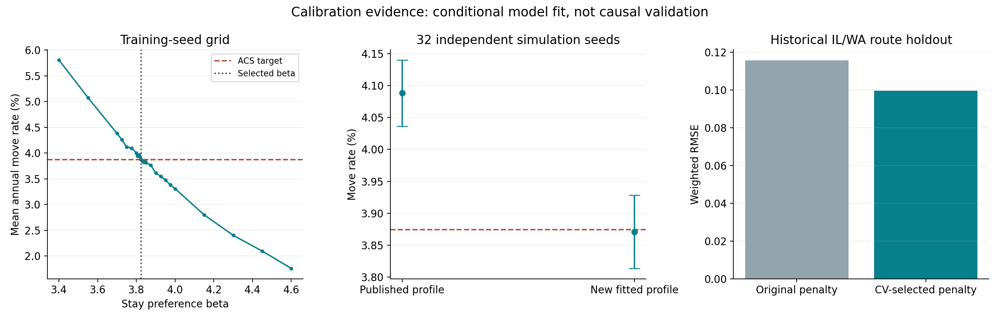
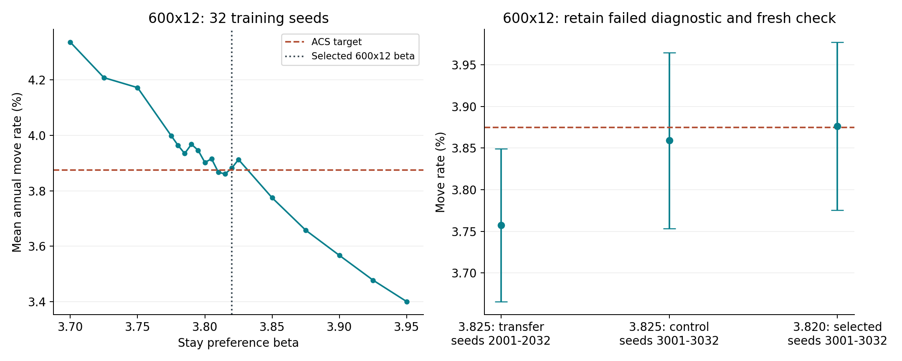

# 当前 V8：新参数校准与可复现性验证

## 结论与使用范围

**已完成基于现有核验数据的新参数拟合、独立模拟种子验证、参数不确定性分析与精度修复控制。**新核心配置的独立验证迁移率为 **3.87094%**，ACS 目标为 **3.87458%**；原发布配置在同一验证种子上的结果为 **4.08813%**。

本次是在当前 V8 机制、官方输入和明确假设下提高拟合与可复现性。它不证明参数是唯一真实值，也不证明政策效果已经因果识别。当前数据没有足够依据重新估计全部社会、人口和政策情景参数。

本报告的“95%模拟区间”均指跨独立随机种子计算的平均指标的t置信区间；不是单次运行的预测区间，不是未来现实迁移率区间，也不包含调查抽样误差。验收容差是预先声明的数值拟合标准，不是领域公认的可靠性阈值。

主校准预先规定的训练与验证标准：训练均值误差不超过 0.05 个百分点；32个独立验证种子的均值误差不超过 0.10 个百分点，且95%模拟区间覆盖 ACS 目标。训练标准 **通过**，独立验证标准 **通过**。

**新参数没有替换 GitHub 和原项目的政策结果缓存。**原4140行政策实验、研究图表与视频仍属于旧发布配置。这里交付的是有完整依据的新参数、运行入口和验证报告；采用新配置的研究政策结论需要重新运行关联实验，不能把旧结果换一个参数标签后继续使用。

**验收边界：**主设置通过：True；600×12设置通过：True；通过的网络衰减：2、5。衰减10未通过：与封闭基线平均差0.13325个百分点，配对差区间0.03657–0.22993个百分点。未通过者不纳入可用默认配置，报告保留失败结果。情景强度和社会/人口结构仍是假设；开放系统的各模式状态见下表。



## 拟合参数与稳定性

| 参数 | 原配置 | 新配置 | 条件 bootstrap 2.5%–97.5% |
|---|---:|---:|---:|
| `beta_income` | 1.0246237 | 1.0775646 | 0.830367–1.28723 |
| `beta_jobs` | 1.2443366 | 1.2259623 | 1.21581–1.24454 |
| `beta_rent` | 0.70194784 | 0.25108314 | 0–0.702444 |
| `beta_distance` | 0.31172356 | 0.59903543 | 0.222478–0.745299 |
| `beta_education` | 0.46151282 | 0.50221256 | 0.439331–0.546431 |
| `beta_childcare` | 0.5210012 | 0.52716251 | 0.500584–0.548231 |
| `beta_current_state` | 3.925 | 3.825 | 3.805–3.845 |
| `beta_current_state_600x12` | 3.925 | 3.82 | 3.78487–3.85 |

六个路线系数的区间来自 **200次按出发州整组重采样**，只有八个州，且先验、范围和正则化强度固定。租金、距离系数区间较宽；就业、教育和托育的窄区间也部分受先验约束影响，不能当作完全由数据确定的精确估计。留州参数的区间来自 **1000次训练模拟种子重采样**，未传播 IRS 参数和 ACS 调查抽样的不确定性。

β=3.8250 是固定数值实现；训练种子重采样的区间为 **3.8050–3.8450**，说明四位小数用于复现，不代表统计精确到四位。

目的地效应的八州值另见 [parameters.json](parameters.json)。社会联系强度0.6/1.0/1.4、政策强度、人口机制、0.85拟合温度和0.90模拟温度等沿用明确的结构或情景假设，没有伪称本次已从观察数据估计。

## IRS 路线拟合方法

使用已从官方2022–2023 IRS数据重建的50条路线和88个州级输入。与原程序相同：四组大学/非大学与有孩/无孩混合概率，六个效用系数与七个目的地效应，报税迁移数平方根加权的份额均方误差，加上系数与目的地效应正则化，带原范围约束的 L-BFGS-B 优化。

为提高执行效率，使用解析梯度和向量计算。与原 pandas 实现的目标函数最大差 **1.04e-17**；解析梯度与中心差分最大差 **1.5e-12**，均已检查。

在六个训练出发州进行留一出发州交叉验证，预先比较原惩罚强度的0.25、1、4倍。采用“一标准误规则”选择可接受候选中较强的正则化，结果选中 **0.25倍**；对应系数惩罚 λ=0.005，目的地效应惩罚 λ=0.0125。先验数值和参数范围属于建模约束，不是官方统计直接给出的偏好参数。

随后只评估预先选好的候选，对历史指定的 IL/WA 留出集不再调参：

| 指标 | 原惩罚强度重新拟合 | CV选择候选 |
|---|---:|---:|
| 加权 RMSE | 0.115586 | 0.099536 |
| 加权 MAE | 0.092343 | 0.077123 |
| 相关系数 | 0.589224 | 0.727426 |

候选通过既定采用规则后，使用全部八个出发州拟合最终参数；三组固定起点取损失较小解。重复同一起点优化的参数差为 **0.0**。IRS 路线不专属于18–35岁，是宏观迁移方向代理；历史留出集已在以前开发中使用，因此不是新外部验证，也不能解释为个体因果效应。

## 当前模型的迁移率校准

目标来自先前已独立重建的2023 ACS PUMS，准确年龄18–35，PWGTP加权。主设置固定1000代理、20年、无政策、中等联系，训练种子 **901–916**，验证种子 **1901–1932**互不重叠。

在3.4–4.6的粗网格、最佳点附近0.025细网格和0.005精网格中，以训练均值距目标的绝对误差选参数。验证种子没有参与选择。训练均值 **3.874688%**，目标 **3.874577%**。

| 配置 | 32个独立模拟种子的均值 | 95%模拟区间 | 对ACS目标的绝对误差（百分点） |
|---|---:|---|---:|
| 原发布IRS参数与β=3.925 | 4.08813% | 4.03617%–4.14008% | 0.213548 |
| 新IRS参数与β=3.8250 | 3.87094% | 3.81360%–3.92828% | 0.003639 |

改善来自新的完整核心配置，不能只归因于β变化。实际又重新执行三个验证案例，全部输出最大差 **0.0**。核心网格、验证与初始规模检查共 **512 个不同模拟案例**。

## 运行规模的适用性

| 设置 | 种子数 | 新配置平均迁移率 | 95%模拟区间 |
|---|---:|---:|---|
| 主设置1000代理×20年 | 32 | 3.87094% | 3.81360%–3.92828% |
| 600代理×12年 | 32 | 3.75738% | 3.66565%–3.84911% |
| 2000代理×20年 | 8 | 3.91031% | 3.84096%–3.97966% |

**1000×20的β=3.8250直接移用于600×12，扩展到32个种子后未通过检查**：目标不在95%模拟区间内，绝对偏差为0.117198个百分点。失败记录保留，不能把该参数称为所有规模通用的校准值。

因此为600×12建立单独协议，使用32个训练种子901–932，预先定义3.70–3.95、步长0.025的粗网格，最佳训练点附近步长0.005的精网格。选择仍只依赖训练均值；采用未用于选择参数的新验证种子3001–3032，并保留之前失败的2001–2032诊断。新的条件参数 **β=3.8200**；训练均值 **3.881944%**。

32个新验证种子的平均迁移率 **3.876302%**，95%模拟区间 **3.775482%–3.977123%**，绝对偏差 **0.001726个百分点**。采用与主设置相同的标准，训练检查 **通过**，独立验证检查 **通过**。训练种子bootstrap区间 **3.7849–3.8500**；三个真实重跑案例最大差 **0.0**。

这次失败暴露了运行设计敏感性与随机波动问题，不能单凭一次区间检验认定系统性的规模偏差，也不意味着现实人的偏好随代理数变化。两个设计的参数区间有重叠；同一β=3.8250在新的600×12验证种子上也得到3.858941%，说明选择某一验证批次会影响表面误差。600×12参数按对应设计保存，1000×20参数也仅在该设计下得到充分检查。2000×20目前只有八种子的初步诊断，其他代理数或年数需要另行验证。自动运行入口按设计选取已通过检查的参数，未知设计不静默套用。



## 网络与开放系统的条件参数

网络校准使用600代理、12年、该设计的新β=3.8200、训练种子901–916；九步二分的访问点和最终中点按训练误差选最佳值，再统一最终四位小数。模拟目标带噪声，不假定误差严格单调。32个验证种子3001–3032未参与选择。这里是保持网络比较基准的模型控制，不是新的独立实证偏好估计。预定验证标准为与同种子封闭基线的平均差不超过0.10个百分点，配对差的95%区间包含0。

| 衰减 | 最终留州参数 | 训练迁移率 | 验证迁移率 | 与封闭基线配对均值差（百分点） | 验证 |
|---|---:|---:|---:|---:|---|
| 2 | 3.5980 | 3.91493% | 3.90321% | 0.02691 | 通过 |
| 5 | 3.3125 | 3.93229% | 3.90755% | 0.03125 | 通过 |
| 10 | 3.0678 | 3.93576% | 4.00955% | 0.13325 | 未通过 |

开放系统目标直接取重建 PUMS 的外部来源份额 **62.02649264%**，即884486 / 1425981；精确数据口径保留波多黎各来源，区别于整体迁移率锚点的排除口径。取代旧0.62近似值，但不改变分类口径。共享与扩容模式分别八步二分，在访问点和最终中点中按训练误差选择，再统一最终四位小数。

| 容量模式 | 最终交换尝试率 | 训练接受外部迁入份额 | 验证接受外部迁入份额 | 验证95%模拟区间 | 验证 |
|---|---:|---:|---:|---|---|
| shared | 0.0940 | 61.7678% | 61.9243% | 61.3226%–62.5259% | 通过 |
| scaled | 0.0678 | 62.2217% | 61.9001% | 61.2862%–62.5141% | 通过 |

这两个模式的交换率不是现实人口迁移率；它们是使该模拟机制匹配外部来源构成的条件控制参数。预定验证标准：绝对偏差不超过1.5个百分点，95%模拟区间覆盖外部来源目标。网络与开放系统共 **1040 个不同校准/验证案例**；另外三个网络/开放系统案例重新执行最大差 **0.0**。未通过对应验证的扩展候选保留在报告中，但不写入自动默认注册表。

## 原47行精度差异的修复验证

在单独的 `precision-fix-project/` 中，只将原Notebook单元67、69的二分最终参数送入模拟前统一四位小数；二分迭代保持完整精度。保持原发布IRS参数及β=3.925，实际重跑 **752行、704个不同案例、5648项指标**，与旧缓存不匹配数从244降到 **0**。

这是证明精度修复能保留原发布结果的对照实验，**不是新参数的政策效果验证**。修复副本还保留此前已验证的开放系统CLI常量加载修正。[源单元补丁](precision-fix.patch)与[逐项结果](precision-fix-report.json)可审查。

## 可复现文件与执行

- [新参数注册表](parameters.json)：完整精度IRS参数、四位标量、目的地效应、来源哈希、运行版本、明确未拟合的假设。
- [原始来源清单](input-source-manifest.json)：先前核验时保存的官方下载链接与哈希，需与重建协议和年龄口径一起解释。
- [参数对照CSV](parameter-comparison.csv)、[全部IRS拟合记录](irs-fit-report.json)
- [核心校准协议](beta-protocol.json)、[全部网格](beta-grid.csv)、[独立验证记录](beta-fit-report.json)
- [扩展参数验证](extension-fit-report.json)、[跨规模诊断](extended-scale-report.json)
- [600×12单独校准协议](research-design-protocol.json)、[拟合与新种子验证](research-design-fit-report.json)
- [诊断Notebook](../calibration-validation.ipynb)、[执行HTML](../calibration-validation.html)（执行完成后生成）
- [实际CLI样例验证](runner-verification-report.json)：基线、组合政策、网络、开放系统均不从模拟检查点读取结果。
- 完整项目可从本 PR 下载，或使用本次交付的完整项目 ZIP；此脚本也会另行生成本地校准包。

固定环境：Python3.10.18、numpy2.2.6、pandas2.3.3、scipy1.15.3、matplotlib3.10.6、joblib1.5.3；工作线程限制为1，多案例使用8进程。`Reproduce-Calibration.ps1` 重做确定性IRS拟合并核对已有检查点；加 `-Fresh` 会备份检查点并真实重跑所有案例。检查点包含输入指纹；数据或参数改变时拒绝混用旧结果。

单案例入口：

```powershell
.venv/Scripts/python.exe run_reliable_case.py --case reliable-calibration/examples/baseline.json --output reliable-calibration/example-result.json
```

运行入口默认读取新注册配置并记录参数文件SHA256。原 Notebook 模型机制原文保持不变，通过显式参数和已核验的原数据CSV载入。包不含虚拟环境和约270MB原始下载，包含模型源、已重建数值输入、来源清单、完整检查点和依赖版本；它是校准验证包，不是已更新全部政策结果的论文项目。

## 答辩时可以说明的结论

“我们将观察数据拟合、模拟目标校准和情景假设明确分开。路线参数通过出发州分组交叉验证选择正则化，当前模型的留州参数使用独立重建的ACS目标与独立模拟种子验证。最终参数数值约定、输入版本和随机种子均保存，重复运行得到相同结果。参数可靠性仍受八州宏观数据、先验和模型结构限制，不能解释成唯一真实个体偏好或已验证的因果政策效果。”
